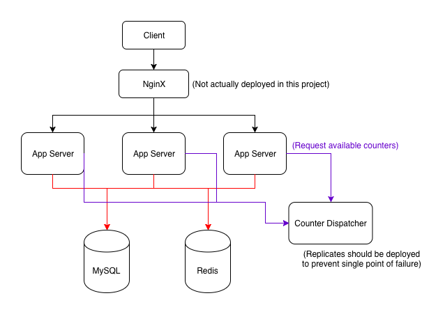
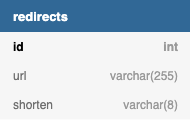
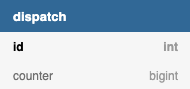

# System Architecture

## System Considerations:
* Number of read (redirection) requests is much larger than write (create shorten url) requests, probably 100:1 ratio.
* Shorten url and original url mappings won't be changed after generated, perfect for caching.
* System must avoid different urls generating the same shorten url (i.e. collisions).

## Components:
* Shorten url service:
  * To provide create shorten url and shorten url redirection services.
* Counter dispatcher:
  * To dispatch the range of counter to each App server.
  * Only one instance is active at a time for requests to avoid race condition on available counter.
    * There would be less counter dispatch requests, comparing with shorten url redirect requests.
    * In order to prevent single point of failure, replicates should be deployed.
    * Can be replaced with other coordinator such as: Zookeeper.
* Load balancer: Nginx (Not actually deployed in this project.)
  * To distribute requests to multiple servers.
* Cache: Redis (or Memcached)
  * To cache shorten url and original url mappings for quick lookup.
  * Reduce read traffics to database.
* Database: MySQL
  * Persistence storage for shorten url and original url mappings.
  * Persistence storage of available counter.
  * Performance can be enhanced with partitions or sharding.
  * Can be replaced with MongoDB for better scalability since relations, transactions and strong consistency are not required.

## Shorten url scenarios:

### Create shorten url:
* Use **'counter value**' scenario.
  * Counter value is encoded into Base62 ([a-zA-Z0-9]) for shorten url.
    * Ex: **'12345'** will be encoded into: **'3d7'**
  * Each App server will request a range of available counters from Counter dispatcher service at start up.
  * When all available counter values have consumed, request another range of available counters from Counter dispatcher service.
* Steps:
  1. Encode current counter value with Base62 encoding as shorten url and increase counter value.
  2. Save shorten url mapping into database for persistence storage.
  3. Save shorten url mapping into cache.

### Redirect shorten url:
* Steps:
  1. Check whether shorten url exists in cache?
     * Read the original url and redirect user with HTTP 301 status code if shorten url exits in Redis cache.
  2. If shorten url does not exists in cache, try to query database.
     * If shorten url does exist in database, read the original url and redirect user with HTTP 301 status code.
     * If shorten url does not exit in database, return HTTP 404 status code to user.

## API:
* Create shorten url:
  * (POST) /shorten:
    * JSON Body: { "url": &lt;url to be shorten&gt; }
* Redirect shorten url:
  * (GET) /{shorten-url} 

## Database schemas (MySQL):

## Installation:
* Please see **README.md** under project's root directory.
